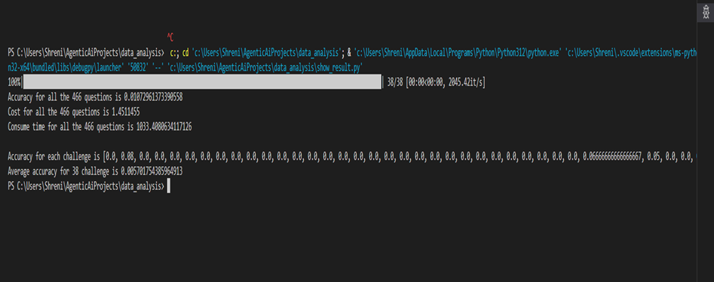

DSBENCH Benchmark Summary

This benchmark is designed to evaluate data science agents on realistic, complex tasks. It consists of 466 data analysis tasks and 74 data modeling tasks, sourced from ModelOff and Kaggle competitions. DSBENCH offers a challenging evaluation environment by incorporating long-context reasoning, multimodal inputs (text, tables, images), multi-table data structures, and end-to-end data modeling scenarios.

Repository Setup & Data Preparation
After cloning the repository, I had two options:

Download raw datasets and process them using the provided Python script, or

Use the pre-processed datasets directly.

I chose to proceed with the processed data, located in the data/ folder. This folder contains 43 tokenized challenges, each stored in a subdirectory named by an ID. Each subdirectory includes:

An introduction file (PDF or .txt)

One or more data files (e.g., Excel or CSV)

A set of questions associated with the data

Task Pipeline
Each task consists of:

I: Task introduction

D = {d₁, d₂, ..., dₙ}: Data files

Q: A list of questions

These inputs are fed into a data science agent G (in our case, gpt-3.5-turbo) to generate answers. The generated answer is then compared with the ground truth provided in data.json.

The comparison is semantic — if the agent's answer captures the same meaning as the ground truth, it is considered correct.

Model Execution & Evaluation
After running the agent and generating answers, I executed show_result.py to evaluate performance. Key metrics returned include:

Overall Accuracy
Accuracy per challenge
Average accuracy
Total cost (based on token usage)
Total inference time

In this run, the model achieved 1.07% accuracy on the 466 questions. This low performance appears to be due to a logic issue in the evaluation script that I had to modify to get the script running. My next step is to fix and improve that snippet to enable a more accurate evaluation.

